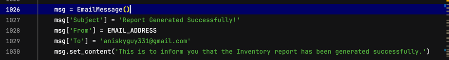

# GreenGrocer 

## About Green Grocer
Green Grocer is an initiative to promote sustainable sourcing. This is to ensure that products sourced are great tasting and good to eat. 

### Our Group Members: 
- Wen Bing: Report Generation
- Ashley: Account Management
- Tia: Transaction Processing
- Rachel: Customer 

## Prerequisites
Before you proceed ensure you obtain the following: 
- Create a database with MYSQL. Donwload MYSQL Workbench. Alternatively, create a MYSQL Database with Aiven Conosle at aiven.io. In this case, the aiven database has been initalised. Do take note that school wifi does not work for the database. As such, personal hotspot might be required.
- requirements.txt is all installed -> pip install -R requirements.txt

## Code Customisation
To set the Email Address, to receive the report it is important for you to modify the code to your preferred email. 

To do the above, Select CTRL + F and search for the variable 'msg['to']. Once done, your email can be set and customised. An example of the variable is shown below on line 1028 in main.py
